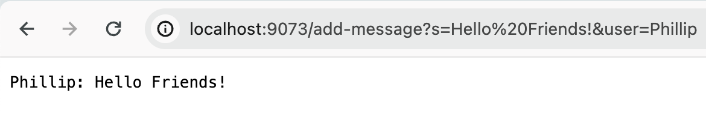
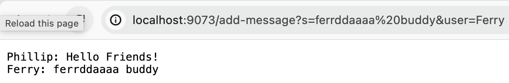

# Lab Report 2

Today, I will be creating a Web Server and learning how to use `ssh`! Many fun activities lie on the road ahead!

---

## Part 1: Web Server

Here, I write a web server called `ChatServer` that keeps track of a single string, which gets added to by incoming requests. Note that I assume that my code is located in the GitHub [wavelet](https://github.com/ucsd-cse15l-f23/wavelet) repository, which allows me to make use of Java classes such as `Server` and `URLHandler`.

First, I make some imports.

```java
import java.io.IOException;
import java.net.URI;
```

Next, I implement a class called `ChatHandler`, which implements the interface `URLHandler` defined in the `wavelet` repository. This class includes a string called `chat` that keeps track of the chat thread, which is initialized to an empty string in the constructor. The main purpose of the `ChatHandler` class is to process various requests from a web server, which is what `handleRequest` deals with. Without any path, the web server will display the current state of `chat`. I can add messages to `chat` using `/add-message?s=<string>&user=<string>` -- my code makes sure that a user inputs a valid query. Unknown requests generate a `404 Not Found!` error, and entering the path `/help` provides a help message.

```java
class ChatHandler implements URLHandler {

    // internal String that stores the chat
    String chat;

    // constructor
    ChatHandler() {
        this.chat = "";
    }

    // handle requests
    public String handleRequest(URI url) {
        // default behavior is to display chat
        if (url.getPath().equals("/")) {
            return this.chat;
        }
        // add a new message to the chat
        else if (url.getPath().equals("/add-message")) {
            String query = url.getQuery(); // get the query
            if (query == null) { // make sure query is valid
                return "Invalid query...See usage:\n/add-message?s=<string>&user=<string>\n";
            }
            String[] arguments = query.split("&"); // get arguments
            if (!(arguments[0].startsWith("s=") && arguments[1].startsWith("user="))) { // make sure query is valid
                return "Invalid query...See usage:\n/add-message?s=<string>&user=<string>\n";
            }
            this.chat += String.format("%s: %s\n", arguments[1].split("=")[1], arguments[0].split("=")[1]); // concatenate to chat
            return this.chat; // output chat
        }
        // help message
        else if (url.getPath().equals("/help")) {
            return "Welcome to ChatServer! Try add-message?s=<string>&user=<string> to add a chat.\n";
        }
        // unknown path
        else {
            return "404 Not Found!\n";
        }
    }
}
```

Lastly, I implement the `ChatServer` class itself, which creates the actual web server. The program is pretty simple: it checks to make sure the user provides a port and then creates a server on that port.

```java
class ChatServer {
    public static void main(String[] args) throws IOException {

        // make sure port is supplied
        if(args.length == 0) {
            System.out.println("Missing port number! Try any number between 1024 to 49151");
            return;
        }

        // get the port
        int port = Integer.parseInt(args[0]);

        // create a web server
        Server.start(port, new ChatHandler());

    }
}
```

### Examples

Here are some examples of `ChatServer` in action.



This request calls the `handleRequest` method, which takes the `URI` object `url` as an argument. This `URI` object holds the most recent request, and allows me to access information such as the request's path and query. Given the request `/add-message?s=Hello Friends!&user=Phillip`, `handleRequest` sees the path `add-message`, which tells the program to undertake a certain course of action, and then checks to make sure the provided query `s=Hello Friends!&user=Phillip` is valid. After all of this happens, the query, now stored as a string, is split up, formatted, and appended to the `chat` instance variable of the `ChatHandler` class. The current state of `chat` is then displayed.



This request calls the `handleRequest` method as well, which, as mentioned previously, takes the `URI` object `url` as an argument. Given the request `/add-message?s=ferrddaaaa buddy&user=Ferry`, `handleRequest` sees the path `add-message` and checks to make sure the provided query `s=ferrddaaaa buddy&user=Ferry` is valid. After all of this happens, the query (a string) is split-up and formatted. It is important that a `\n` character is added to the end of the new chat so that it appends well to the `chat` instance variable. Once again, the current, updated state of `chat` is displayed.

---

## Part 2: SSH

```
philliplong@Phillip-Longs-MacBook-Air ~ % pwd
/Users/philliplong
philliplong@Phillip-Longs-MacBook-Air ~ % ls ~/.ssh
config          id_ed25519      id_ed25519.pub  id_rsa          id_rsa.pub      known_hosts     known_hosts.old
philliplong@Phillip-Longs-MacBook-Air ~ % ls /Users/philliplong/.ssh
config          id_ed25519      id_ed25519.pub  id_rsa          id_rsa.pub      known_hosts     known_hosts.old
philliplong@Phillip-Longs-MacBook-Air ~ % ls /Users/philliplong/.ssh/id_rsa
/Users/philliplong/.ssh/id_rsa
```

On my local drive, the absolute path of the *private* `ssh` key for logging into `ieng6` is `/Users/philliplong/.ssh/id_rsa`.

```
[p1long@ieng6-203]:~:56$ pwd
/home/linux/ieng6/oce/69/p1long
[p1long@ieng6-203]:~:57$ ls ~/.ssh
authorized_keys
[p1long@ieng6-203]:~:58$ ls /home/linux/ieng6/oce/69/p1long/.ssh
authorized_keys
[p1long@ieng6-203]:~:59$ ls /home/linux/ieng6/oce/69/p1long/.ssh/authorized_keys
/home/linux/ieng6/oce/69/p1long/.ssh/authorized_keys
```

On the `ieng6` server, the absolute path of the *public* `ssh` key for logging into `ieng6` is `/home/linux/ieng6/oce/69/p1long/.ssh/authorized_keys`.

---

Having set up my `ssh` keys, I can now easily log onto my `ieng6` account without entering my password! See below. _Note that I was **not** prompted for a password._

```
philliplong@Phillip-Longs-MacBook-Air ~ % ssh p1long@ieng6.ucsd.edu
Last login: Wed Jan 24 10:47:52 2024 from 100.81.37.193
Hello p1long, you are currently logged into ieng6-202.ucsd.edu

You are using 0% CPU on this system

Cluster Status 
Hostname     Time    #Users  Load  Averages  
ieng6-201   10:45:01   23  0.34,  0.77,  0.72
ieng6-202   10:45:01   12  0.09,  0.26,  0.26
ieng6-203   10:45:01   19  0.14,  0.20,  0.22

 

To begin work for one of your courses [ cs15lwi24 ], type its name 
at the command prompt.  (For example, "cs15lwi24", without the quotes).

To see all available software packages, type "prep -l" at the command prompt,
or "prep -h" for more options.
[p1long@ieng6-202]:~:46$
```

---

## Part 3: Reflection

I did not know I could a create a web server in Java! I have absolutely no experience in web development, but this revelation makes me wonder if I could create a website entirely in Java. Can I? That'd be really cool. Though I have a gut feeling that Java, for a variety of reasons, isn't meant for web development. That's probably the reason for JavaScript. Also, I always see the word "port" being thrown around, so it is nice to finally understand what it means.

---

I hope you enjoyed reading my lab report. To 7 more fun weeks of *CSE15L*!